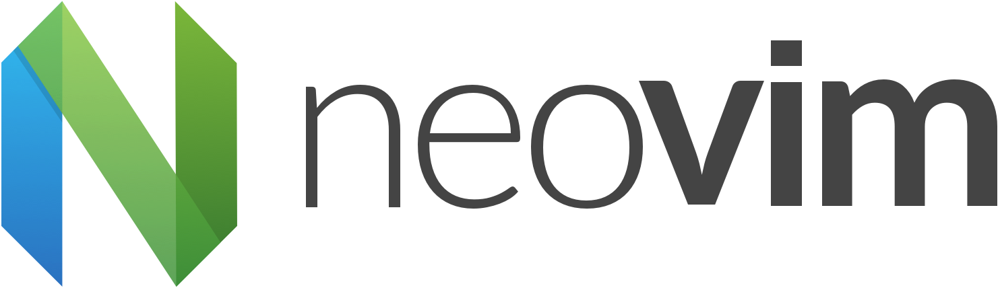

[](https://waffle.io/neovim/neovim.github.io)



This repository contains the source for the neovim.io website; visit the
[core repository](https://github.com/neovim/neovim) for details on
the Neovim project.

## Contributing
...

## Setup

### Installing Ruby gems
`sudo gem install bundler` to get bundler, then you can just `bundle install` to install all the gems.

### Serving locally
```
jekyll serve --watch
```
Open on `http://localhost:4000`

### Running tests
```
bundle exec rake test
```

### (Optionally) Regenerate dependencies
Install bower if you don't have it:
```
npm install bower
```
Then install the JS dependencies with `bower install`.

## License

&copy; 2014 Cameron Eagans and Josh Branchaud

Licensed under the MIT License. See LICENSE for details.
